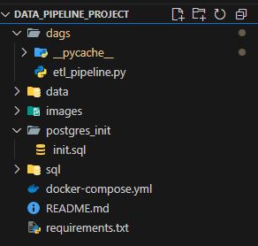
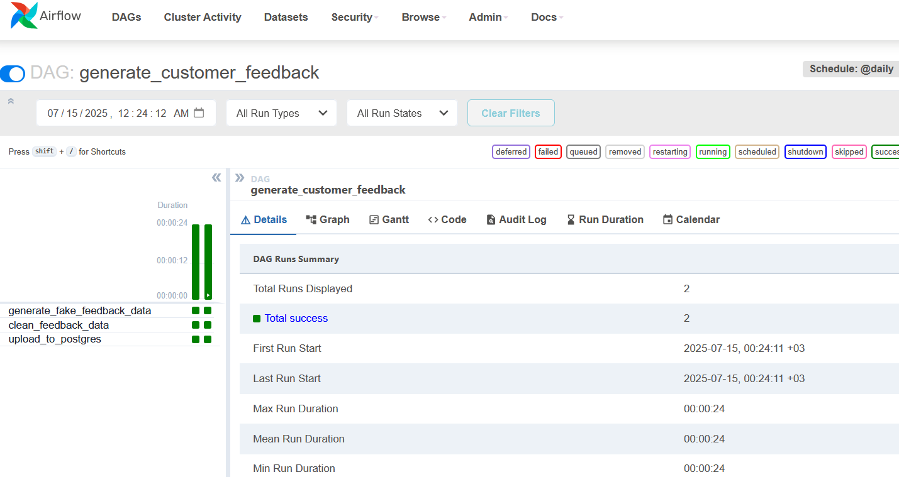
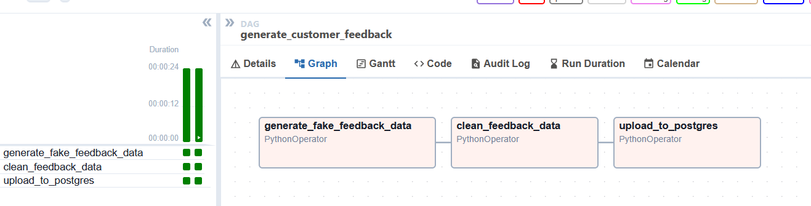
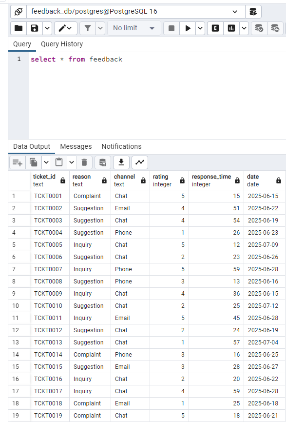

# 📦 End-to-End Data Pipeline using Airflow & PostgreSQL

This project demonstrates a complete data pipeline using Apache Airflow. It generates fake support tickets, cleans them with Pandas, and loads them into a PostgreSQL database — all orchestrated through Airflow running in Docker.

---

## 🚀 Features

- Generate fake data using Faker  
- Clean and transform data using Pandas  
- Load data into PostgreSQL  
- Scheduled and automated using Airflow DAG  
- Fully containerized using Docker  

---

## 🛠️ Tech Stack

| Tool           | Purpose                             |
|----------------|-------------------------------------|
| Python         | Data generation and transformation  |
| Apache Airflow | Orchestration of the pipeline       |
| PostgreSQL     | Data warehouse                      |
| Docker         | Containerization                    |
| Pandas         | Data wrangling                      |
| Faker          | Synthetic data generation           |

---

## 🧱 Project Structure



---

## ⚙️ How to Run the Project

### 1️⃣ Clone the repo

```bash
git clone https://github.com/mashaellab/data_pipeline_project.git
cd data_pipeline_project

````

2️⃣ Start the containers
```bash
docker-compose up --build 
```

Airflow Web UI → http://localhost:8080
Username: admin
Password: admin


3️⃣ Trigger the DAG

    Go to the Airflow UI

    Find etl_pipeline

    Trigger it manually or wait for the schedule

4️⃣ Verify the data in PostgreSQL

Connect to DB with DBeaver or pgAdmin:

    Host: localhost

    Port: 5432

    User: airflow

    Password: airflow

    Database: airflow

Run:
```bash
SELECT * FROM feedback;
```

## 📷 Screenshots

### DAG View in Airflow



---

### Graph View



---

### Data in PostgreSQL




📚 Learning Outcome

    Designing ETL pipelines

    Working with Airflow and PostgreSQL

    Using Docker in real-world workflows

    Writing production-level Python code

👩‍💻 Author

Mashael Abdulrhman


